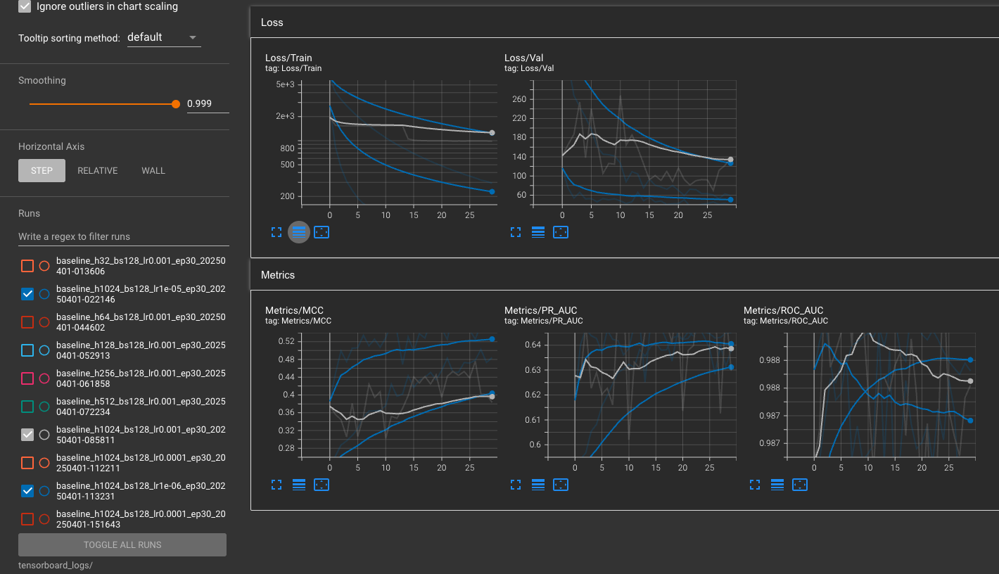

# Protein Similarity Classification using BioZernike Descriptors

This repository provides a PyTorch-based framework for classifying protein structural similarity using BioZernike descriptors. Developed as part of the RCSB PDB Data Science internship task, the pipeline supports efficient dataset handling, model training, and evaluation workflows at scale.

---

##  Directory Overview

```
rcsb_pdb_nn/
├── model.py               # Defines the neural network model (MLP)
├── train.py               # Training loop and evaluation logic
├── dataset.py             # Dataset class
├── tensorboard_utils.py   # Setup for TensorBoard logging
├── util.py                # Descriptor classes and distance metrics
├── weight_strategy.py     # Weighted sampling strategies
│
├── data/
│   ├── cath_moments.tsv   # CATH dataset (geometric + Zernike features)
│   └── ecod_moments.tsv   # ECOD dataset for testing
│
├── cache/                 # Contains partitioned and merged caches
├── logs/                  # Log files per training run
├── modelData/             # Stores best and per-epoch model checkpoints
└── Main.ipynb             # Notebook for exploration and testing
```

---

##  Setup

```bash
# Clone repository
git clone https://github.com/akshitagarwal1998/rcsb_pdb_nn.git
cd rcsb_pdb_nn

# Setup environment
conda create -n tf_keras python=3.12
conda activate tf_keras
pip install -r requirements.txt
```

---

## Modes of Operation

### 1. Streaming Mode ( using on the fly computation for nC2 pairs of proteins)

### Training

```python
from train import train_model
from weight_strategy import inverse_class_weighting

df = pd.read_csv("data/cath_moments.tsv", sep='\t', header=None).dropna(axis=1)
input_dim = df.shape[1] - 1
model = train_model(protein_df=df.head(num_proteins),
                    hidden_dim=128,
                    input_dim=input_dim,
                    batch_size=128,
                    num_epochs=30,
                    val_split=0.1,
                    lr=1e-3)
```

---

## Evaluation

To evaluate the model on the ECOD dataset:

```python
from train import test_model_on_ecod

ecod_df = pd.read_csv("data/ecod_moments.tsv", sep='\t', header=None).dropna(axis=1)
test_model_on_ecod(model, ecod_df)
```

---

## TensorBoard Logging

All metrics are logged via TensorBoard. To launch the dashboard:

```bash
tensorboard --logdir=tensorboard_logs
```

Visit [http://localhost:6006](http://localhost:6006) in your browser to view training progress.

---

## Features

- Efficient pairwise streaming via generator for scalability
- TensorBoard integration for real-time training monitoring
- Saves best and per-epoch model checkpoints for reproducibility
- Compatible with both CPU and GPU

---

## Notes

- Set `persistent_workers=True` and tune `prefetch_factor` in `DataLoader` for large-scale runs.
- Best model is saved in `modelData/best_model.pt`.

---

## Results

### Experiment 1 – Constant Learning Rate (1e-3) with Variable Hidden Dimension

The results show that as we increase the hidden dimension with a constant learning rate of 1e-3, the model performance improves.  
A hidden dimension of 1024 provides the best performance for learning protein classification.


---

### Experiment 2 – Variable Learning Rate with Constant Hidden Dimension (1024)

The results show that a learning rate of 1e-5 yields the best results.  
At 1e-6, the model begins to underfit the data, while 1e-3 is too large and unstable for convergence.



---

The plot below compares key evaluation metrics (ROC AUC, PR AUC, MCC) across different network configurations.


---

## Zenodo Archive

[](https://doi.org/10.5281/zenodo.15106965)

This project’s TensorBoard logs and evaluation artifacts are archived on Zenodo:  
https://zenodo.org/records/15106965

---

## Author

**Akshit Agarwal**  
MS in Computer Science, UC San Diego  
Email: aka002@ucsd.edu  
GitHub: [akshitagarwal1998](https://github.com/akshitagarwal1998)
